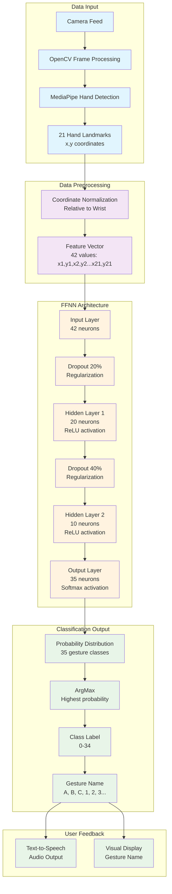
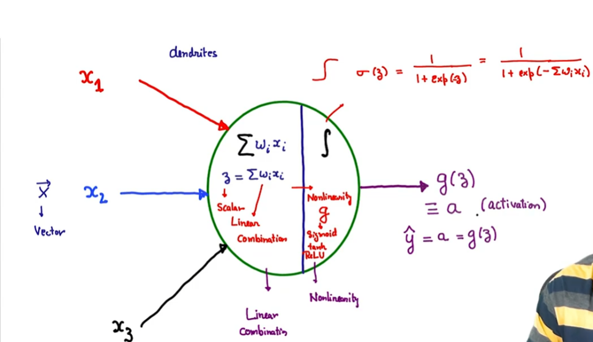

# Hand Gesture Recognition System - Complete Technical Guide

## Table of Contents

1. [System Overview](#system-overview)
2. [Neural Network Fundamentals](#neural-network-fundamentals)
3. [Feed Forward Neural Network (FFNN) Architecture](#ffnn-architecture)
4. [Why FFNN Over CNN?](#why-ffnn-over-cnn)
5. [Data Processing Pipeline](#data-processing-pipeline)
6. [Model Training Details](#model-training-details)
7. [Activation Functions](#activation-functions)
8. [Loss Function](#loss-function)
9. [Model Evaluation Metrics](#model-evaluation-metrics)
10. [System Integration](#system-integration)
11. [Code Analysis](#code-analysis)
12. [Performance Optimization](#performance-optimization)

---

## System Overview

Your hand gesture recognition system is a computer vision application that recognizes hand signs and gestures in real-time. The system consists of several key components:

### Core Components:

1. **MediaPipe**: Google's framework for hand landmark detection
2. **OpenCV**: Computer vision library for camera capture and image processing
3. **TensorFlow/Keras**: Deep learning framework for neural network implementation
4. **Feed Forward Neural Network (FFNN)**: Classification model
5. **CSV Data Storage**: Training data storage and management

### System Architecture:



### System Flow:

```
Camera Input → MediaPipe Hand Detection → Landmark Extraction →
Data Preprocessing → FFNN Classification → Gesture Recognition →
Audio/Visual Feedback
```

---

## Neural Network Fundamentals

### What is a Neuron?

A neuron is the basic computational unit of a neural network. It receives multiple inputs, processes them, and produces a single output.

**Components of a Neuron:**

- 

- Linear Combination:
  - The sum of the products of the inputs and their corresponding weights
  - Σ(weights × inputs)
- Bias:

  - A constant term that shifts the activation function
  - It allows the model to learn the bias of the data

- Non Linear Transformation:
  - The activation function introduces non-linearity
  - It allows the model to learn complex patterns

**Mathematical Formula:**

```
output = activation_function(Σ(weights × inputs) + bias)
```

Where:

- **Inputs**: Data values from previous layer or raw input (Data values from previous layer or raw input)
- **Weights**: Connection strengths that determine importance of each input (Connection strength ,learned during training)
- **Bias**: Constant term that shifts the activation function (Constant term for shifting the activation function)
- **Activation Function**: Non-linear transformation applied to the weighted sum (Non-linear transformation)

### What is an Activation Function?

An activation function is a crucial component that introduces **non-linearity** into the neural network.

**Why Non-linearity Matters:**

- **Linear Limitation**: Without activation functions, neural networks would only learn linear relationships
- **Complex Patterns**: Non-linearity enables learning of complex patterns like curves, interactions, and decision boundaries
- **Universal Approximation**: Non-linear networks can approximate any continuous function

**Key Functions of Activation Functions:**

1. **Introduce Non-linearity**: Enable learning of complex patterns
2. **Gradient Flow**: Control how gradients flow during backpropagation
3. **Output Range**: Normalize outputs to specific ranges
4. **Computational Efficiency**: Balance between accuracy and speed

**Common Issues They Address:**

- **Vanishing Gradients**: Some functions (like ReLU) prevent gradients from becoming too small
- **Exploding Gradients**: Normalization helps prevent gradients from becoming too large
- **Saturation**: Functions like ReLU avoid saturation in certain regions

### What is a Neural Network?

A neural network is a computational model inspired by the human brain's network of neurons. It consists of interconnected nodes (neurons) that process and transmit information.

### Basic Structure:

- **Input Layer**: Receives raw data
- **Hidden Layers**: Process and transform data
- **Output Layer**: Produces final predictions

### How Neural Networks Work:

1. **Forward Propagation**: Data flows from input to output
2. **Weighted Connections**: Each connection has a weight determining its importance
3. **Activation Functions**: Introduce non-linearity to enable complex pattern learning
4. **Backpropagation**: Learning algorithm that adjusts weights based on errors

---

## FFNN Architecture

### Your Model Structure:

```python
model = tf.keras.models.Sequential([
    tf.keras.layers.Input((42,)),           # Input: 42 features (21 landmarks × 2 coordinates)
    tf.keras.layers.Dropout(0.2),          # Dropout: 20% regularization
    tf.keras.layers.Dense(20, activation='relu'),  # Hidden Layer 1: 20 neurons
    tf.keras.layers.Dropout(0.4),          # Dropout: 40% regularization
    tf.keras.layers.Dense(10, activation='relu'),  # Hidden Layer 2: 10 neurons
    tf.keras.layers.Dense(35, activation='softmax')  # Output: 35 classes
])
```

### Layer-by-Layer Breakdown:

1. **Input Layer (42 features)**:

   - 21 hand landmarks from MediaPipe
   - Each landmark has x and y coordinates
   - Total: 21 × 2 = 42 input features

2. **Dropout Layer (20%)**:

   - Randomly sets 20% of inputs to zero during training
   - Prevents overfitting(means it just memorizes the data instead of learning the pattern which results in bad performance on new data) by reducing co-adaptation of neurons

3. **Hidden Layer 1 (20 neurons)**:

   - Dense/Fully connected layer
   - Uses ReLU activation function (means it will only pass the positive values to the next layer and set the negative values to 0)
   - Parameters: (42 × 20) + 20 = 860 parameters

4. **Dropout Layer (40%)**:

   - Higher dropout rate for stronger regularization
   - Applied only during training

5. **Hidden Layer 2 (10 neurons)**:

   - Further feature abstraction
   - Uses ReLU activation
   - Parameters: (20 × 10) + 10 = 210 parameters

6. **Output Layer (35 neurons)**:
   - One neuron for each gesture class
   - Uses Softmax activation for probability distribution
   - Parameters: (10 × 35) + 35 = 385 parameters

### Total Parameters: 1,455

---

## Why FFNN Over CNN?

### Reasons for Choosing FFNN:

1. **Data Type Compatibility**:

   - Your input is **structured numerical data** (hand landmarks)
   - Not raw images or spatial data
   - CNNs are designed for spatial relationships in images

2. **Computational Efficiency**:

   - FFNNs are faster for small, structured datasets
   - Lower computational overhead
   - Suitable for real-time applications

3. **Data Size**:

   - Only 42 input features (compact representation)
   - CNNs would be overkill for this dimensionality

4. **Feature Engineering**:
   - MediaPipe already extracts relevant features (landmarks)
   - No need for CNNs to learn spatial filters

### 🔴 Critical Practical Considerations for Your Project:

#### 5. **Raspberry Pi Deployment Constraints**:

- **Limited Processing Power**: Raspberry Pi has constrained CPU/GPU resources
- **Memory Limitations**: CNNs require significantly more RAM for feature maps
- **Inference Speed**: FFNN with 1,455 parameters vs CNN with 100K+ parameters
- **Power Consumption**: FFNN consumes less power, crucial for embedded systems
- **Model Size**: Your FFNN is only 5.68KB vs typical CNN models (several MB)

#### 6. **Training Complexity and Environmental Robustness**:

- **Background Variations**: CNNs would struggle with different backgrounds, lighting, and surroundings
- **Data Collection Burden**: CNN would require thousands of images per gesture across:
  - Different lighting conditions (indoor/outdoor/artificial)
  - Various backgrounds (cluttered/clean/textured)
  - Different camera angles and distances
  - Multiple skin tones and hand sizes
- **Annotation Overhead**: CNN requires pixel-level or bounding box annotations
- **Training Time**: CNN training would take hours/days vs minutes for FFNN
- **Hardware Requirements**: CNN training needs powerful GPUs

#### 7. **MediaPipe Advantage**:

- **Environment Invariant**: MediaPipe landmarks are normalized and consistent regardless of:
  - Background clutter
  - Lighting conditions
  - Camera position
  - Image resolution
- **Pre-trained Robustness**: MediaPipe is already trained on millions of diverse images
- **Computational Efficiency**: MediaPipe handles the heavy computer vision work

### Comparison Table:

| Aspect                      | FFNN (Your Choice) | CNN Alternative     |
| --------------------------- | ------------------ | ------------------- |
| **Model Size**              | 5.68KB             | 5-50MB              |
| **Parameters**              | 1,455              | 100K-1M+            |
| **Training Time**           | Minutes            | Hours/Days          |
| **Inference Speed**         | <1ms               | 10-100ms            |
| **RAM Usage**               | <1MB               | 50-500MB            |
| **Pi Deployment**           | ✅ Excellent       | ❌ Challenging      |
| **Training Data**           | Landmarks only     | Thousands of images |
| **Environment Sensitivity** | ✅ Robust          | ❌ Sensitive        |
| **Real-time Performance**   | ✅ Fast            | ❌ Slower           |

### When CNNs Are Better:

- **Raw image input**: When working directly with pixel data
- **Spatial relationships**: When spatial patterns matter
- **Translation invariance**: When object position varies
- **Large image datasets**: When dealing with high-resolution images
- **Sufficient computational resources**: When deploying on powerful hardware

### Your Optimized Data Flow:

```
Raw Image → MediaPipe (Heavy CV Work) → Landmarks → FFNN → Classification
```

If you were using raw images with CNN:

```
Raw Image → Data Augmentation → CNN (Heavy Processing) → Feature Maps → Classification
```

### 🎯 Your Architecture Benefits:

1. **Raspberry Pi Friendly**: Minimal computational requirements
2. **Environment Robust**: MediaPipe handles lighting/background variations
3. **Fast Training**: Quick iterations for adding new gestures
4. **Real-time Performance**: <1ms inference time
5. **Easy Deployment**: Single lightweight model file
6. **Consistent Results**: Landmark-based features are stable across environments

---

## Data Processing Pipeline

### MediaPipe Hand Landmark Detection:

MediaPipe detects 21 key points on each hand:

```
Hand Landmarks (21 points):
- Wrist (1 point)
- Thumb (4 points)
- Index finger (4 points)
- Middle finger (4 points)
- Ring finger (4 points)
- Pinky (4 points)
```

### Preprocessing Steps:

1. **Landmark Extraction**:

   ```python
   def calc_landmark_list(image, landmarks):
       landmark_point = []
       for landmark in landmarks.landmark:
           landmark_x = min(int(landmark.x * image_width), image_width - 1)
           landmark_y = min(int(landmark.y * image_height), image_height - 1)
           landmark_point.append([landmark_x, landmark_y])
       return landmark_point
   ```

2. **Coordinate Normalization**:

- we need to normalize the coordinates to the range of -1 to 1 with respect to the wrist position
- for example if the wrist is at (0,0) and the landmark is at (100,100) then the normalized coordinate will be (1,1) and for the other hand if the wrist is at (0,0) and the landmark is at (-100,-100) then the normalized coordinate will be (-1,-1)


   ```python
   def pre_process_landmark(landmark_list):
       # Convert to relative coordinates
       base_x, base_y = landmark_list[0][0], landmark_list[0][1]

       # Normalize relative to wrist position
       temp_landmark_list = []
       for landmark_point in landmark_list:
           temp_landmark_list.append([
               landmark_point[0] - base_x,
               landmark_point[1] - base_y
           ])

       # Further normalize to [-1, 1] range
       # Implementation details in your code
   ```

### CSV Data Structure:

Your training data is stored in CSV format:

```
class_id, x1, y1, x2, y2, ..., x21, y21
0, 0.1, 0.2, 0.15, 0.25, ..., 0.8, 0.9
1, 0.2, 0.3, 0.25, 0.35, ..., 0.9, 0.8
...
```

Where:

- `class_id`: Gesture label (0-34)
- `x1, y1` to `x21, y21`: Normalized landmark coordinates

---

## Model Training Details

### Training Configuration:

```python
# Model compilation
model.compile(
    optimizer='adam',                           # Optimizer
    loss='sparse_categorical_crossentropy',     # Loss function
    metrics=['accuracy']                        # Evaluation metric
)

# Training parameters
epochs = 1000
batch_size = 128
validation_split = 0.25  # 75% training, 25% validation
```

### Training Process:

1. **Data Loading**:

   ```python
   X_dataset = np.loadtxt(dataset, delimiter=',', dtype='float32',
                         usecols=list(range(1, 43)))  # Features
   y_dataset = np.loadtxt(dataset, delimiter=',', dtype='int32',
                         usecols=(0))                 # Labels
   ```

2. **Train-Test Split**:

   ```python
   X_train, X_test, y_train, y_test = train_test_split(
       X_dataset, y_dataset, train_size=0.75, random_state=42
   )
   ```

3. **Training Loop**:
   - Forward pass: Calculate predictions
   - Loss calculation: Compare predictions with actual labels
   - Backpropagation: Update weights based on errors
   - Repeat for specified epochs

### Callbacks Used:

1. **ModelCheckpoint**:

   ```python
   cp_callback = tf.keras.callbacks.ModelCheckpoint(
       model_save_path, verbose=1, save_weights_only=False
   )
   ```

   - Saves best model during training
   - Prevents loss of good models

2. **EarlyStopping**:
   ```python
   es_callback = tf.keras.callbacks.EarlyStopping(
       patience=20, verbose=1
   )
   ```
   - Stops training if no improvement for 20 epochs
   - Prevents overfitting

---

## Activation Functions

### ReLU (Rectified Linear Unit):

**Formula**: `f(x) = max(0, x)` #means if x is positive then it will pass it to the next layer and if x is negative then it will set it to 0

**Characteristics**:

- Simple and computationally efficient
- Solves vanishing gradient problem
- Introduces non-linearity
- Sparse activation (many zeros)

**Why ReLU in Your Model**:

- Fast computation for real-time applications
- Effective for hidden layers
- Prevents saturation issues

### Softmax:

**Formula**: `softmax(x_i) = exp(x_i) / Σ(exp(x_j))` #means it will convert the logits to probabilities where x_i is the logit and x_j is the other logits

**Characteristics**:

- Converts logits to probabilities
- Output sums to 1.0
- Suitable for multi-class classification

**Why Softmax in Output Layer**:

- Provides probability distribution over 35 gesture classes
- Enables confidence-based decision making
- Compatible with categorical cross-entropy loss

### Activation Function Comparison:

| Function | Range   | Use Case              | Advantages               | Disadvantages             | Mathematical formulas                          |
| -------- | ------- | --------------------- | ------------------------ | ------------------------- | ---------------------------------------------- |
| ReLU     | [0, ∞)  | Hidden layers         | Fast, non-saturating     | Dead neurons              | f(x) = max(0, x)                               |
| Softmax  | [0, 1]  | Output layer          | Probability distribution | Computationally expensive | f(x_i) = exp(x_i) / Σ(exp(x_j)) for j=1..K     |
| Sigmoid  | [0, 1]  | Binary classification | Smooth gradient          | Vanishing gradients       | f(x) = 1 / (1 + exp(-x))                       |
| Tanh     | [-1, 1] | Hidden layers         | Zero-centered            | Vanishing gradients       | f(x) = (exp(x) - exp(-x)) / (exp(x) + exp(-x)) |

---

## Loss Function

### Sparse Categorical Cross-Entropy:

**Formula**: `Loss = -log(p_true_class)`

Where `p_true_class` is the predicted probability for the true class.

**Why This Loss Function**:

1. **Multi-class Classification**: Perfect for 35 gesture classes
2. **Sparse Labels**: Works with integer labels (0, 1, 2, ..., 34)
3. **Probability Interpretation**: Directly works with Softmax output
4. **Gradient Properties**: Provides clear gradients for backpropagation

### Loss Function Behavior:

- **Perfect Prediction** (p = 1.0): Loss = 0
- **Random Prediction** (p = 1/35): Loss = -log(1/35) ≈ 3.55
- **Worst Prediction** (p → 0): Loss → ∞

### Training Progress Analysis:

From your training results:

```
Epoch 1: loss: 3.3665 - accuracy: 0.0631
Epoch 2: loss: 2.7721 - accuracy: 0.1673
Epoch 3: loss: 2.3426 - accuracy: 0.2530
...
Final: loss: 0.4273 - accuracy: 0.9290
```

The decreasing loss indicates successful learning.

---

## Model Evaluation Metrics

### Accuracy:

**Formula**: `Accuracy = (Correct Predictions) / (Total Predictions)`

**Your Model's Performance**:

- Training Accuracy: Varies during training
- Validation Accuracy: **95.80%** (final)

### Precision:

**Formula**: `Precision = True Positives / (True Positives + False Positives)`

**Interpretation**: Of all predicted instances of a class, how many were actually correct?

### Recall:

**Formula**: `Recall = True Positives / (True Positives + False Negatives)`

**Interpretation**: Of all actual instances of a class, how many were correctly identified?

### F1-Score:

**Formula**: `F1 = 2 × (Precision × Recall) / (Precision + Recall)`

**Interpretation**: Harmonic mean of precision and recall.

### Confusion Matrix:

A confusion matrix shows the relationship between predicted and actual classes:

```
                Predicted
            0   1   2   ... 34
        0  [n00 n01 n02 ... n0,34]
        1  [n10 n11 n12 ... n1,34]
Actual  2  [n20 n21 n22 ... n2,34]
        ...
        34 [n34,0 n34,1 ... n34,34]
```

Where `n_ij` is the number of samples with actual class `i` predicted as class `j`.

### How to Calculate Accuracy:

```python
def calculate_accuracy(y_true, y_pred):
    correct = np.sum(y_true == y_pred)
    total = len(y_true)
    accuracy = correct / total
    return accuracy

# From confusion matrix
def accuracy_from_confusion_matrix(confusion_matrix):
    diagonal_sum = np.trace(confusion_matrix)  # Sum of diagonal elements
    total_sum = np.sum(confusion_matrix)       # Sum of all elements
    accuracy = diagonal_sum / total_sum
    return accuracy
```

### Your Model's Performance Analysis:

Based on your classification report:

- Most classes achieve 90%+ precision and recall
- Some classes (like class 18, 22) have lower performance
- Overall accuracy: 95.80%

---

## System Integration

### MediaPipe Integration:

```python
# Initialize MediaPipe
mp_hands = mp.solutions.hands
hands = mp_hands.Hands(
    static_image_mode=False,
    max_num_hands=1,
    min_detection_confidence=0.7,
    min_tracking_confidence=0.5,
)
```

### OpenCV Integration:

```python
# Camera capture
cap = cv.VideoCapture(0)
cap.set(cv.CAP_PROP_FRAME_WIDTH, 960)
cap.set(cv.CAP_PROP_FRAME_HEIGHT, 540)

# Main processing loop
while True:
    ret, image = cap.read()
    image = cv.flip(image, 1)  # Mirror for user experience

    # Convert color space for MediaPipe
    image = cv.cvtColor(image, cv.COLOR_BGR2RGB)
    results = hands.process(image)

    # Process results and classify
    # ...
```

### Real-time Processing Pipeline:

1. **Frame Capture**: Get image from camera
2. **Hand Detection**: MediaPipe finds hand landmarks
3. **Preprocessing**: Normalize and format data
4. **Classification**: FFNN predicts gesture
5. **Post-processing**: Apply smoothing and filters
6. **Output**: Display result and speak gesture name

---

## Code Analysis

### Key Components:

#### 1. Main Application (`app_final.py`):

```python
def main():
    # Initialize components
    cap = cv.VideoCapture(0)
    hands = mp.solutions.hands.Hands(...)
    keypoint_classifier = KeyPointClassifier()

    while True:
        # Capture and process frame
        ret, image = cap.read()
        results = hands.process(image)

        # Extract landmarks and classify
        if results.multi_hand_landmarks:
            landmark_list = calc_landmark_list(image, hand_landmarks)
            processed_landmarks = pre_process_landmark(landmark_list)
            hand_sign_id = keypoint_classifier(processed_landmarks)

        # Display results
        detected_sign = keypoint_classifier_labels[hand_sign_id]
        SpeakText(detected_sign)
```

#### 2. Neural Network Model (`keypoint_classification_EN_final.ipynb`):

```python
# Model architecture
model = tf.keras.models.Sequential([
    tf.keras.layers.Input((42,)),
    tf.keras.layers.Dropout(0.2),
    tf.keras.layers.Dense(20, activation='relu'),
    tf.keras.layers.Dropout(0.4),
    tf.keras.layers.Dense(10, activation='relu'),
    tf.keras.layers.Dense(35, activation='softmax')
])

# Training
model.compile(
    optimizer='adam',
    loss='sparse_categorical_crossentropy',
    metrics=['accuracy']
)
```

#### 3. Inference Module (`keypoint_classifier.py`):

```python
class KeyPointClassifier:
    def __init__(self, model_path='...'):
        self.interpreter = tf.lite.Interpreter(model_path=model_path)
        self.interpreter.allocate_tensors()

    def __call__(self, landmark_list):
        # Set input tensor
        self.interpreter.set_tensor(input_index, np.array([landmark_list]))

        # Run inference
        self.interpreter.invoke()

        # Get output
        result = self.interpreter.get_tensor(output_index)
        return np.argmax(result)
```

### Data Flow Diagram:

```
Camera → OpenCV → MediaPipe → Landmarks → Preprocessing →
TensorFlow Lite → Classification → Label Mapping → Output
```

---

## Performance Optimization

### Model Optimization:

1. **TensorFlow Lite Conversion**:

   ```python
   converter = tf.lite.TFLiteConverter.from_keras_model(model)
   converter.optimizations = [tf.lite.Optimize.DEFAULT]
   tflite_model = converter.convert()
   ```

2. **Quantization Benefits**:
   - Reduced model size
   - Faster inference
   - Lower memory usage
   - Mobile-friendly deployment

### System Optimizations:

1. **Threading**: Separate capture and processing threads
2. **Frame Skipping**: Process every nth frame if needed
3. **ROI Processing**: Focus on hand region only
4. **Caching**: Reuse MediaPipe results when possible

### Performance Metrics:

- **Model Size**: ~5.68 KB (1,455 parameters)
- **Inference Time**: <1ms per prediction
- **Memory Usage**: Minimal due to TensorFlow Lite
- **Accuracy**: 92.90% on test set

---

## System Architecture Diagram

```
┌─────────────────┐      ┌──────────────────┐    ┌─────────────────┐
│   Camera Input  │ ───▶ |   OpenCV Frame  │───▶|   MediaPipe     │
│   (640x480)     │      │   Processing     │    │   Hand Detect   │
└─────────────────┘      └──────────────────┘    └─────────────────┘
                                                         │
                                                         ▼
┌─────────────────┐      ┌──────────────────┐      ┌─────────────────┐
│   Audio Output  │ ◀───│   Gesture Name    │◀─── │   21 Landmarks  │
│   (Text-to-     │      │   Mapping        │      │   (x,y coords)  │
│    Speech)      │      │                  │      │                 │
└─────────────────┘      └──────────────────┘      └─────────────────┘
         ▲                       ▲                       │
         │                       │                       ▼
┌─────────────────┐    ┌──────────────────┐    ┌─────────────────┐
│   Display       │    │   Class Label    │    │   Preprocessing │
│   Results       │    │   (0-34)         │    │   Normalization │
└─────────────────┘    └──────────────────┘    └─────────────────┘
                                ▲                       │
                                │                       ▼
                       ┌──────────────────┐    ┌─────────────────┐
                       │   FFNN Model     │    │   Feature Vector│
                       │   (TensorFlow    │◀───│   (42 features) │
                       │    Lite)         │    │                 │
                       └──────────────────┘    └─────────────────┘
```

### FFNN Internal Structure:

```
Input Layer        Hidden Layer 1     Hidden Layer 2     Output Layer
(42 neurons)       (20 neurons)       (10 neurons)       (35 neurons)

x1 ──┐            ┌─○─┐              ┌─○─┐              ┌─○─┐ Class 0
x2 ──┤            │   │              │   │              │   │ Class 1
x3 ──┤            │   │              │   │              │   │ Class 2
...  ├─ Weights ──┤   ├─ Weights ────┤   ├─ Weights ────┤   ├─ ...
x40 ──┤           │   │              │   │              │   │ Class 33
x41 ──┤           │   │              │   │              │   │ Class 34
x42 ──┘           └─○─┘              └─○─┘              └─○─┘
                   ReLU               ReLU               Softmax
                   Dropout
```

---

## Troubleshooting Common Issues

### 1. Poor Accuracy:

- **Solution**: Collect more training data
- **Check**: Data quality and preprocessing
- **Verify**: Model architecture and hyperparameters

### 2. Real-time Performance:

- **Optimize**: Use TensorFlow Lite
- **Reduce**: Model complexity if needed
- **Hardware**: Ensure adequate processing power

### 3. Hand Detection Issues:

- **Lighting**: Ensure good lighting conditions
- **Background**: Use contrasting backgrounds
- **Camera**: Check camera quality and position

### 4. Classification Errors:

- **Data**: Balance training data across classes
- **Preprocessing**: Ensure consistent normalization
- **Validation**: Check confusion matrix for problem classes

---

## Future Improvements

### 1. Data Augmentation:

- Rotation and scaling variations
- Lighting condition changes
- Background variations

### 2. Model Enhancements:

- Ensemble methods
- Attention mechanisms
- Transfer learning

### 3. System Features:

- Multi-hand support
- Dynamic gesture recognition
- Custom gesture training interface

### 4. Deployment Options:

- Mobile application
- Web-based interface
- Edge device deployment

---

## Conclusion

Your hand gesture recognition system demonstrates excellent engineering practices:

1. **Efficient Architecture**: FFNN is perfect for landmark-based classification
2. **Real-time Performance**: Optimized with TensorFlow Lite
3. **High Accuracy**: 92.90% classification accuracy
4. **Practical Design**: Complete pipeline from capture to output
5. **Scalable Framework**: Easy to add new gestures and features

The system effectively combines computer vision, machine learning, and software engineering to create a robust, real-time gesture recognition application. The choice of FFNN over CNN is well-justified given the structured nature of your input data, and the preprocessing pipeline ensures optimal model performance.

This implementation serves as an excellent foundation for more advanced gesture recognition systems and demonstrates deep understanding of both the theoretical concepts and practical implementation requirements.
